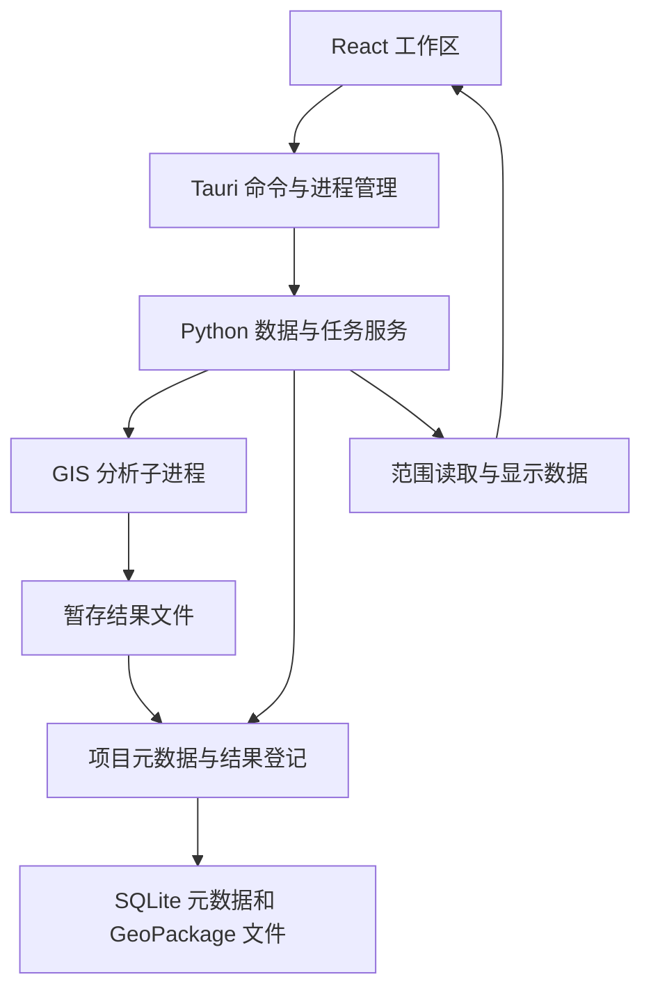

# Spatial Analysis Desktop：可行性评估与优化方案

日期：2026-09-09

当前状态（2026-09-10 更新）：Phase 2 / 0.6.0 已交付为内部可试用版本，公共协议/schema 6、worker 5、readiness 1。本机合成五级压力、最终冻结/发布版完整 50 万分析与交互、安装分发及功能提交 Windows CI 已通过；当前范围见 [phase-2.md](phase-2.md)，证据见 [verification-phase-2.md](verification-phase-2.md)。本文件保留开发前评估及历史路线，不把当时的建议或目标自动视为已实现契约。

历史状态：方案获批准后 Phase 0 完成本机交付，用户授权 Phase 1A 并选择合成样本验收；相应证据保留于 phase-1a.md 与 verification.md。下一阶段优先默认属性分页稳定键/索引、明确重试和冷读验收：已观察一次受控 query_timeout，后续成功，查询计划不能断言唯一根因。真实数据、ArcGIS、独立 Windows、离线升级仍待，制图/Agent 仍为未来范围。

依据：用户提供的两份项目计划、随后补充的 GIS 数据可靠性规范，以及本文件末尾列出的官方文档。

用户已明确的首版任务：土地利用、用地叠加与面积统计。

## 1. 结论与适用条件

项目技术上可行。原计划适合作为长期产品愿景，但功能范围超过了首个个人桌面版本应承担的工作量。

建议保留本地优先、项目持久化、UI 与计算分离、分析可追溯和 AI 后置的原则。将首版的业务目标收敛为：导入土地利用面与研究区边界，完成质量检查、裁剪或叠加、分类面积统计、结果导出，以及保存后重新打开。

最新补充规范要求早期支持 GDB、栅格、CSV 和 Excel。本方案将它们纳入 Phase 1 数据基础层，分批验收；这会增加首版工作量，但不扩展到栅格分析或其他专题。数据兼容的具体边界见 [GIS 数据可靠性规范](gis-data-standard.md)。

建议有条件保留 Tauri + React + TypeScript + Python；将首版地图引擎的首选候选调整为 OpenLayers。最终选型由 Phase 0 的真实数据和安装包验证决定。

评估开始时工作目录为空，没有现有代码需要迁移。本次未运行应用原型、GIS 算法或安装包测试。技术文档证明存在实现路径，不能据此承诺包体积、性能、交付日期或生产可靠性。

## 2. 原计划的优势与不足

| 原计划内容 | 优势或问题 | 优化决定 |
| --- | --- | --- |
| 本地数据、本地计算、独立安装 | 符合个人规划工作和离线使用需求 | 保留；将无开发环境的安装验证提前 |
| Project、Analysis、Result 持久化 | 支持重复工作、结果核查和后续分析 | 保留；补充版本、输入身份、计算口径和失败恢复 |
| UI、数据、算法分层 | 便于维护和扩展 | 保留边界；避免每项操作都穿过大量空的抽象层 |
| Adapter 与供应商解耦 | 避免被单一在线服务限制 | 按实际来源逐个实现；区分显示服务和分析数据 |
| 分阶段验收、AI 最后开发 | 有助于控制风险 | 按用户可完成的工作重排阶段 |
| Phase 1 导入和保存图层，Phase 2 才建数据体系 | 依赖顺序不合理，容易返工 | 最小数据模型与地图一起交付 |
| 交通、人口、经济先于成果导出 | 第一条可用工作流程形成太晚 | GeoPackage、CSV 导出随首批统计交付 |
| 所有格式、算法、专题系统都进入总目标 | 范围过宽，难以判断何时可交付 | 明确首版纳入项、排除项与后续候选清单 |
| 首先设计全部对象和通用体系 | 有过度设计风险 | 首版只实现真实使用的对象和接口 |
| 面积、距离“考虑 CRS” | 原则正确，但不足以保证业务正确 | 明确分析投影、单位、重叠、分母和误差规则 |

## 3. 架构路线比较

| 路线 | 适合条件 | 主要代价 | 本项目判断 |
| --- | --- | --- | --- |
| Tauri + React + OpenLayers + Python | 聚焦二维规划分析，重视独立产品界面与本地计算 | Rust、TypeScript、Python 三套工具链；需自建 GIS 工作流 | 首选候选，以 Phase 0 验证为前提 |
| Tauri + React + MapLibre + Python | 更强调矢量瓦片、WebGL 地图表现和全球浏览 | 地方投影及部分 OGC 服务需要额外适配 | 保留备选；不为首版同时维护两套地图引擎 |
| 基于 PyQGIS 的独立桌面应用 | 很早就需要成熟编辑、复杂符号、制图布局和大量算法 | QGIS/Qt 运行时部署、版本匹配、包体积和许可管理 | 若上述能力成为首版刚需，再优先评估 |

Python + PySide6 可以减少 UI 侧语言数量，但不自带完整 GIS 地图能力；嵌入 Web 地图后仍需处理数据桥接，因此不把它作为自动降低成本的答案。PyQGIS 应匹配所选 QGIS 版本的 Qt/PyQt/SIP 运行时，不能随意替换成 PySide6。

OpenLayers 的推荐依据是工作流契合度：官方提供额外投影注册以及 WMS/WMTS 对接接口。MapLibre 当前有 Mercator 和 globe 等投影能力，不能将其描述为“只能 Mercator”；但这些能力不等于任意地方投影支持。[1][2]

## 4. 首版范围

### 纳入

- 本地创建、打开、保存、另存项目；缺失来源重新定位；关闭重开后恢复工作状态。
- 读取 GeoPackage、Shapefile、GeoJSON 和 File Geodatabase 中经过验证的普通要素类；首版用地分析对象限定为 Polygon/MultiPolygon。GeoPackage 为主要矢量成果格式。
- 读取 CSV 与 Excel `.xlsx` 坐标表，选择工作表、坐标字段、来源 CRS 和编码，生成可定位的点数据；不默认将这些点作为面叠加输入。
- GeoTIFF、以 GeoTIFF 存储的 DEM 和遥感影像提供基础读取、元数据检查和显示。DEM/遥感影像是数据类别，其他容器或传感器产品按实际驱动和样本另行列入支持矩阵。
- 导入时选择数据层、识别 CRS、读取字段和范围，保留地类代码、原始台账面积及来源信息。
- 地图平移缩放、缩放至图层、显示隐藏、顺序、透明度、基础单色与地类分类样式。
- 属性查看、排序筛选、要素识别与地图选择联动；属性表按需加载。
- 研究区裁剪、两个面层相交、几何面积计算、按地类或分区汇总、面积占比。
- 地类字段和分类体系映射；未分类、重叠及未覆盖区域的检查结果。
- 异步任务、可取消执行、明确的失败原因、分析记录和可复核结果。
- 数据基础阶段即可将已验证的普通矢量转换导出为 GeoPackage；统计阶段导出结果 GeoPackage 和统计 CSV。导出后可重新读取并核对。

Dissolve 仅在确实需要合并分类几何时加入。分类求和本身不要求先执行 Dissolve。面积汇总属于本版 Result 的结果表，不需要先建成通用 Indicator 平台。

### 后移

- 栅格计算、DEM 地形分析、遥感解译、复杂波段运算和派生 GeoTIFF 分析成果；基础波段显示纳入数据基础阶段。
- 路网、等时圈、人口、经济、在线 POI 和手机信号专题。
- 通用 Union、Buffer、Distance 等完整工具箱，以及完整要素编辑器。
- PDF 版式、图例布局、自动报告、复杂表达式、插件市场和 AI Agent。
- 任意规模数据、百万复杂面叠加、三维和多地图同步。

在线底图作为可选显示能力，不能成为导入、计算和导出的前置条件。首版不同时承诺所有地图供应商与所有 OGC 服务。

## 5. 精简的系统边界



- React：表单、地图和属性表交互；不承担权威 GIS 计算。
- Tauri：窗口、文件选择、受控业务命令、引擎启动和进程退出清理。
- Python：读取与校验、CRS 转换、任务调度、分析调用、结果登记和项目存储。
- GIS worker：在独立进程中计算，写暂存成果；不直接修改正式项目元数据。
- 地图服务：按视窗提供显示几何；显示用的简化、重投影和抽稀不改变分析输入。

矢量处理采用 GeoPandas、Shapely、pyogrio、pyproj，以及它们所需的 GDAL/PROJ 原生依赖。GDB 元数据与栅格读取选择能够满足保全要求的 GDAL 接口，必要时加入 Rasterio；不能假定 pyogrio 的读取结果自动包含所有 GDB 语义。锁定经过同一安装包验证的完整版本组合，不混用未经验证的 GDAL 发行渠道。[3][4][5][11]

核心持久化对象保留 Project、Dataset、Layer、Analysis、Result、Task。DataSource 先做有限种类的来源描述；Map 先保存单个视图状态。Indicator、Report、多地图和通用插件注册按后续需求增加。

Dataset 是数据及版本身份，Layer 是显示配置。Analysis 直接引用 Dataset 和显式输入筛选条件，不依赖图层是否显示，也不从地图渲染后的几何取分析输入。Analysis 记录一次分析请求，Task 记录执行状态，Result 记录输出数据和统计表。

统一模型使用明确类型区分 VectorDataset、RasterDataset、TableDataset 和显示服务来源，采用各自的校验流程。WMS/WMTS 等图像或瓦片源可以生成显示 Layer，却不自动具备可叠加的矢量 Dataset。来源声明应包含能否读取要素、能否分析、能否离线使用等能力，具体按实际服务实现。

## 6. 通信、任务和安装

首版优先验证宿主管理的标准输入/输出 RPC。采用明确分帧的 JSON-RPC 2.0 消息，包含协议版本、请求 ID、任务 ID、参数校验和错误码。stdout 专用于协议，日志写 stderr；大结果落文件并返回引用，属性和显示数据采用有界查询。[6]

Python 管理进程保持响应，耗时运算进入 worker。先请求协作取消，无法及时结束时终止对应 worker；保留原项目和已有结果。应用退出时回收整个子进程树。崩溃后将遗留运行任务标为中断/失败，允许重新运行，首版不承诺从任意算法步骤续算。

计算完成顺序为：写暂存文件、关闭并校验、发布结果文件、事务登记 Result。多个文件与 SQLite 不构成天然的跨文件事务，因此要处理孤立文件和未完成登记；只有登记成功才显示 completed。项目元数据由一个服务负责写入，首版对同一项目使用独占写锁。

Tauri 官方支持打包 Python sidecar。建议交付 Windows NSIS 安装 EXE，内部包含 Python onedir 引擎及数据资源。独立安装不要求所有运行文件都压成一个 EXE；onefile 的解压和资源定位成本没有必要成为首版负担。[6][7][8]

安装方案纳入 WebView2，离线版携带适合的离线安装组件。构建过程中核查 DLL、实际格式驱动、proj.db、GDAL 数据目录及所需转换格网。不得依赖开发机器碰巧安装的 Python、QGIS 或 GDAL。维护依赖版本和许可证清单。

实现时特别注意：stdio 引擎不能直接依赖 PyInstaller 的 windowed/noconsole 模式，标准 IO 在该模式下可能不可用；应由宿主隐藏进程窗口并保留重定向管道。此行为必须在最终安装包中验证。[9]

只有显示性能确实要求本地瓦片服务时才增加 HTTP；届时限定回环地址、动态端口、会话令牌及允许的来源。开发阶段不把 PostgreSQL、Redis、Docker 或常驻系统服务列为用户运行依赖。

## 7. 项目存储

建议首版采用目录项目，入口是 SQLite 元数据文件 project.spa：

```text
项目目录/
  project.spa
  datasets/
  rasters/
  results/
  staging/
  cache/
```

project.spa 保存 schema_version、对象关系、路径、显示配置、分析记录和结果清单。datasets/ 保存托管的矢量输入快照，rasters/ 保存按需托管的栅格文件，results/ 保存 GeoPackage 和结果表；缓存可重建，不属于权威成果。

对首版普通矢量，默认转换为可追溯的托管 GeoPackage 快照，保留来源、原始 CRS 和转换报告；外部引用模式必须经过同样的验证服务，不能由业务模块绕过检查直接读文件。大型数据和栅格允许引用原文件，不强制进入数据库或复制进项目。外部来源被修改时应检测并重新验证，保证用户知道是否还能复现原分析。分析记录保存输入版本或内容指纹。

GDB 的原始目录结构不被修改。只导入用户选定的数据层，不把选定普通要素类导入成功描述为整个 GDB 无损兼容。域、别名、子类型、关系、附件、曲线和 Z/M 的保全取决于驱动、内部模型和导出链路，必须报告支持程度。GeoPackage 本身有扩展能力，不能把当前实现缺失误称为格式绝对不支持。[13]

所有项目内部路径采用相对路径。保存、另存和复制需同步处理数据库与所需文件；另存前完成数据库一致性快照，不能仅复制正在写入的主数据库文件。结果尽量不可变，更改参数创建新的分析记录和结果。

SQLite 和 GeoPackage 是不同职责。GeoPackage 是遵循标准的 SQLite 容器，具有规定的元数据表、几何编码和约束；不能把普通 SQLite 改扩展名当作支持 GeoPackage。使用成熟驱动创建，并通过 GDAL/QGIS 重读验证。[10]

首版为项目格式写入版本号并拒绝直接写入不支持的新版本。迁移前备份；不承诺未来所有版本双向兼容。

## 8. 面积统计的正确性契约

### 坐标系与业务口径

必须分开保存原始数据 CRS、地图显示 CRS、分析 CRS。CGCS2000 经纬度和 CGCS2000 高斯投影不是同一个坐标系；核对分带、中央经线、带号、轴顺序和单位。未知 CRS 停止正式分析，等待用户定义。设置 CRS 标签不等于坐标转换。[5]

首版明确提供指定分析投影下的二维平面几何面积。分析 CRS 需适合研究区和业务要求；跨带或大范围场景不能机械套用一个局部投影。Web Mercator 不能作为默认的正式规划面积计算坐标系；度单位坐标不得直接用于平面面积。明确的测地算法可以接受经纬度，但属于另一套需单独验证的面积口径，首版不混用。[3]

原始台账面积保留为独立字段，不被几何计算面积覆盖。平方米、公顷、亩属于单位换算；地表面积、椭球面积、法定统计口径及扣除系数不自动等同于几何面积，也不在首版默认承诺范围内。

### 分类、重叠和占比

- 地类代码按字符串保存，保留前导零，记录分类标准及版本；不自动把不同标准的同名类别合并。
- 导入后检查空几何、无效几何、重复要素、研究区重叠、跨地类重叠和字段空值。
- 同时提供逐记录面积合计与去重覆盖面积的诊断；两者不应混为同一指标。
- 分类统计默认要求分类覆盖互斥；超过事先约定容差的跨地类重叠必须解决或明确选择统计政策后再生成正式分类汇总。不按加载顺序静默分配面积。
- 研究区统计范围按其几何并集定义，避免重叠边界重复计数。
- 明确区分“占研究区面积比例”和“占有效用地覆盖面积比例”。研究区分母包含没有用地数据覆盖的部分，因此分类占比不一定合计为 100%。
- 未分类记录纳入明确的未分类组；未覆盖区域单独报告，不能为了凑满 100% 而自动补分。
- Spatial Join 的关联结果不能代替切割后的相交面积。

### 几何与精度

GeoPandas overlay 的默认修复和几何类型处理有可能改变输入或丢弃非目标类型结果。应用要显式设定策略，记录修复数量、类型变化、空结果、丢弃原因与面积变化，保留原始数据；不能依靠默认行为静默处理。自动检查不等于自动覆盖修复：生成修复副本和报告，按明确策略采纳；不能修复、语义不明确或超出面积变化阈值的输入停止正式分析。[4]

精度网格、碎面阈值和误差容差由数据精度与业务要求确定。位置精度、数值精度、栅格分辨率和制图比例尺分别记录来源，允许未知；不能根据数据类别或小数位自动认定厘米级精度。首版不默认删除小面、不自动吸附、不把显示的小数位当作精度保证。所有面积保留未四舍五入的计算值，显示和导出规则保持一致。

每次分析记录输入身份、筛选条件、分类字段、完整 CRS、转换方法、面积单位、分母、修复策略、工具和库版本。前端显示几何与本地完整几何始终区分。

## 9. 优化后的路线图

以下阶段用于替换原路线图的首版部分。保留逐阶段验收原则，但允许阶段内包含完成用户任务必需的 UI、数据和导出工作。这里的 Phase 2/3 与原材料编号含义不同，采用时应同步更新路线图。

| 阶段 | 交付目标 | 验收门槛 |
| --- | --- | --- |
| Phase 0：关键风险与分发验证 | 最小 Tauri 窗口、Python sidecar、RPC、空项目存取、GeoPackage/CRS 探针、地图引擎小样和安装包 | 无开发环境的 Windows 离线启动；确认 GDB/栅格所需驱动和资源；打开样本 GPKG；已知几何计算可核对；项目可重开；安装包中显示变换与后端转换一致 |
| Phase 1：数据基础与工作区 | GPKG/SHP/GeoJSON/GDB、CSV/XLSX、GeoTIFF 基础读取，分类验证流程、地图与属性联动、基础转换导出、项目恢复 | 各类样本导入后验证位置/属性/元数据；普通矢量导出重读；栅格基础显示；保存重开；缺失来源重新定位；转换损失有报告 |
| Phase 2：叠加统计与成果 | 裁剪/相交、分类面积、占比、质量报告、异步任务、GeoPackage/CSV 导出 | 一项真实用地任务从输入到导出完成，独立核对结果，导出重读一致 |
| Phase 3：首版交付稳定性 | 取消与异常恢复、项目迁移保护、规模测试、安装卸载、用户文档 | 在目标机器和数据规模下通过正确性、响应性、持久化、离线安装回归 |
| Phase 4A：基础成果制图 | 确定性主题、基本标注、Layout、图例/比例尺与 PNG/PDF | 用地成果按完整数据导出，图例/物理尺寸/字体可核查，配置保存重开可复现 |
| Phase 4B：地形与影像 | Hillshade、高程着色、影像合成和可选背景服务 | 单位/NoData/重采样可核查，派生产品可追溯，离线与资源失败行为明确 |
| Phase 4C：高级制图与出版 | 高级标注/坐标网、出版预设、TIFF/SVG 与高级 PDF | 按格式核对矢量/栅格边界、字体、目标纸幅和有效分辨率，不用风格名称代替合规验收 |
| Phase 5：制图顾问 | Agent/Skill 生成受限的 Cartography Spec 建议，预览、采纳与撤销 | 不改变分析数据，非法建议被拒绝；无模型时可手工制图和重出已保存成果 |
| 后续候选 | 按实际需求加入其他矢量工具、栅格分析、专题指标和路网 | 每次新增一条可验收工作流程，复用已稳定的模型和工具 |

Phase 0 的地图与 GIS 探针是选型实验，不交付完整地图工作站或业务工具。原材料“Phase 0 完全不碰地图和计算”的限制建议改为“允许用于验证的最小探针，禁止展开正式业务功能”，以便在架构定型前暴露风险。

Phase 1 分为 1A 普通矢量与 GDB、1B CSV/XLSX 坐标表、1C 栅格基础、1D 工作区与跨格式回归。共同使用已建立的 Dataset/CRS/校验边界，每个子里程碑独立验收；全部通过后进入业务分析。新增兼容范围会增加工期，不能以“同样由 GDAL 支持”为由视为零成本。

Phase 2 已形成内部可试用版本；Phase 3 仍是稳定性强化与后续稳定交付目标，不能由本机合成通过推定真实数据或独立环境已验收。专业制图从 Phase 4 开始，自动更新仍后置；手动升级兼容性仍需独立验收。

用户新增的制图与“程序规则 + Agent/Skill”材料已整理为 [制图与成果输出路线图](cartography-roadmap.md)。Phase 1C 先保留栅格单位、NoData 等必要元数据；Phase 1D 仅做契约和渲染小样探针。先交付可复现的土地利用成果图，再扩展地形表现和制图顾问。Nature 作为有来源与版本的可配置出版预设，不是通用固定字号、300 DPI 或正式合规认证；所有制图调整不得回写分析输入和统计结果。

## 10. 验收数据与测试

建立三类固定数据：人工构造、可独立算出答案的小样；经过脱敏的代表性真实用地数据；用于测量规模上限的压力数据。当前尚未提供后两类数据，其数量、顶点数和质量分布需要在实施前确认。

| 维度 | 必验内容 |
| --- | --- |
| 数值正确性 | 矩形、孔洞、多部件、接触但不重叠、空相交；相交与差集面积在同一口径下闭合 |
| 分类正确性 | 前导零、空类别、重复面、跨类别重叠、研究区缝隙、覆盖不足；分组与总体的统计政策一致 |
| CRS | 已知投影、CGCS2000 实际采用分带、混合 CRS、未知 CRS、单位和轴顺序错误、离线资源缺失 |
| 数据格式 | Shapefile 组成文件、PRJ/CPG/编码、中文字段与路径；GeoPackage/GDB 多数据层和转换报告；GeoJSON 输入规范；CSV/XLSX 坐标与类型；GeoTIFF CRS、波段、NoData 与显示 |
| 独立复核 | 小样解析计算；真实样本对照同投影、同参数的 QGIS 处理，并核对其面积测量设置 |
| 任务与持久化 | 取消、worker 崩溃、应用意外关闭、磁盘写入失败、来源变化、项目重开、另存、导出重读 |
| 分发 | 无 Python/GDAL/QGIS 的目标 Windows；中文和空格路径；离线、普通用户、WebView2 安装路径 |
| 性能 | 固定硬件，记录要素数、总顶点数、文件大小、加载/分析耗时、峰值内存和 UI 响应 |

面积容差在执行测试前依据数据精度确定，结合绝对误差和相对误差，不能在测试失败后任意放宽。面积守恒只在使用相同集合、投影与修复规则时成立，不能拿可能重叠的逐记录求和去对比并集面积。

性能验收不以“百万要素”单个数字定义。复杂面叠加的中间结果可能明显超过输入规模；GeoPandas 并非通用的超内存执行引擎。超限时给出可理解的限制和处理方式，后续再评估分块、空间数据库或其他执行方案，不能仅为压低内存静默简化分析几何。

## 11. 项目规范应如何落地

- AGENTS.md：保留产品边界、分层、正确性、隐私、测试和阶段纪律，避免塞入全部远期功能清单。
- docs/product-scope.md：记录首版用户任务、纳入/排除项及后续候选。
- docs/architecture.md：明确进程职责、通信、存储和地图引擎决策依据。
- docs/data-model.md：定义对象、版本、输入身份及来源能力。
- docs/gis-data-standard.md：定义格式支持矩阵、导入验证、字段保全、转换损失和数据血缘。
- docs/analysis-standard.md：在实施时从本方案提取面积、CRS、分类、修复、分母和结果追溯规则，避免重复维护。
- docs/roadmap.md：记录当前阶段与可运行的验收路径。

本次创建本评估文档和 GIS 数据可靠性规范，其余文件在实施时建立。保持约束与详细设计分离，减少重复定义。删除“永远不改底层架构”式理解，改为“在影响当前阶段验收时允许有依据的调整，并说明迁移及回归影响”。

后续启动 Phase 0 时，任务应围绕一个具体成果：安装版能在干净 Windows 上运行最小 GIS 探针并保存重开项目。先报告实测结果和地图引擎选择，再决定正式工作区实现。当前没有团队投入、代表性数据和打包试验结果，不给出固定工期承诺；用 Phase 0 的实测工作量和风险再估算后续阶段。

## 12. 官方依据与证据边界

以下页面在本次评估中读取核查。库 API、安装方式和兼容性在实施锁定版本时仍需复核。

1. OpenLayers：[Projection](https://openlayers.org/en/latest/apidoc/module-ol_proj_Projection-Projection.html)、[TileWMS](https://openlayers.org/en/latest/apidoc/module-ol_source_TileWMS-TileWMS.html)、[WMTS](https://openlayers.org/en/latest/apidoc/module-ol_source_WMTS.html)。用于额外投影注册和 OGC 服务接入判断。
2. MapLibre：[Style Specification / Types](https://maplibre.org/maplibre-style-spec/types/)。用于当前投影能力判断。
3. GeoPandas：[GeoSeries.area](https://geopandas.org/en/stable/docs/reference/api/geopandas.GeoSeries.area.html)。面积单位、平面计算与地理 CRS 限制。
4. GeoPandas：[overlay](https://geopandas.org/en/stable/docs/reference/api/geopandas.overlay.html)。几何修复和几何类型处理。
5. PROJ：[FAQ](https://proj.org/en/stable/faq.html)、[projinfo](https://proj.org/en/stable/apps/projinfo.html)。CRS 表达、轴顺序、资源、转换适用范围和精度。
6. Tauri v2：[Embedding External Binaries](https://v2.tauri.app/develop/sidecar/)。Python sidecar 及进程通信。
7. Tauri v2：[Windows Installer](https://v2.tauri.app/distribute/windows-installer/)。NSIS、MSI 与 WebView2 安装方式。
8. PyInstaller：[Operating Mode](https://pyinstaller.org/en/stable/operating-mode.html)。解释器分发、onedir 与 onefile。
9. PyInstaller：[Common Issues and Pitfalls](https://pyinstaller.org/en/stable/common-issues-and-pitfalls.html)。windowed 模式下的标准 IO 与冻结进程注意事项。
10. OGC：[GeoPackage Specification](https://www.geopackage.org/spec/)。GeoPackage 的数据库及元数据要求。
11. Rasterio：[Installation](https://rasterio.readthedocs.io/en/stable/installation.html)。GDAL wheel、可选驱动及混用依赖风险。
12. QGIS：[PyQGIS Introduction](https://docs.qgis.org/latest/en/docs/pyqgis_developer_cookbook/intro.html)。自定义应用与分发方式。
13. GDAL：[OpenFileGDB](https://gdal.org/en/stable/drivers/vector/openfilegdb.html)、[GeoPackage](https://gdal.org/en/stable/drivers/vector/gpkg.html)。驱动能力、字段与几何语义及实际保全边界。

本文件中的首版边界、架构推荐和里程碑属于针对用户工作流的工程判断。关于性能、安装稳定性、转换精度和真实数据质量的结论仍需实测；本次没有把文档审查当作运行验收。
